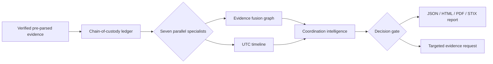

# Multi-Agent Autonomous Cyber-Forensics POC

This directory adds a **self-contained, offline-first, rule-based proof of concept** to the existing repository. It turns the supplied planning documents, agent instructions, runbooks, and notebook sketch into executable code with validated contracts, parallel specialist analysis, evidence fusion, coordination, audit logs, reports, tests, and an API.

> **Scope notice.** This is forensic *triage software*, not a production forensic suite or a court-admissibility guarantee. It processes pre-parsed, integrity-verified artifact metadata. It does not execute uploaded files, malware, macros, or shellcode; it does not use paid APIs; and it does not make actor attribution claims as fact.

## Implemented Capability

| Layer | What is implemented | Constraint enforced |
|---|---|---|
| Evidence intake | Typed artifacts, SHA-256 field validation, verified-only gate, hash-chained case ledger. | Any unverified artifact halts the pipeline before agent execution. |
| Parallel analysis | Seven isolated rule-based specialists: logs, network, memory, malware metadata, cloud, endpoint, and offline threat intelligence. | Evidence values are treated as data, never instructions. |
| Fusion and timeline | Entity deduplication, provenance-aware graph edges, UTC ordering, and documented time conflicts. | Naive timestamps are rejected by validation. |
| Coordination | Quality-weighted confidence, Dempster–Shafer combination, gap/conflict detection, decision gate, attribution hypotheses. | Confidence cannot exceed `0.99`; attribution is explicitly hypothesis-only. |
| Output | JSON, HTML, optional PDF, and a minimal STIX 2.1-style bundle. | Human-readable IOCs are defanged and reports state their limitations. |
| Access | FastAPI endpoints and a `mafc` CLI. | No outbound network lookup is implemented. |

The ATT&CK-style technique fields support analyst mapping to the Enterprise knowledge base, which catalogues adversary tactics and techniques derived from real-world observations.[1] The export structure is intentionally compatible in concept with STIX 2.1, a language and serialization format for cyber-threat and observable information.[2]

## Architecture



Every specialist produces `AgentOutput` records. Fusion deduplicates entities by `type + value` and preserves contributing agent IDs. Coordination aggregates only corroborating agent scores, subtracts documented conflict weights, identifies evidence gaps, and chooses a conservative decision.

## Quick Start

The following commands assume Python 3.11+ and run only in this directory. Create a virtual environment if desired; the implementation requires no database, message broker, cloud account, or model server.

```bash
cd forensics_poc
python3 -m pip install -e '.[dev]'
mafc demo
pytest
```

The demo writes the case audit chain under `cases/CASE-POC-20260715-001/` and reports under `reports/CASE-POC-20260715-001/`. It uses reserved documentation IP ranges and wholly synthetic evidence.

```bash
# Verify the tamper-evident POC ledger
mafc verify-ledger cases/CASE-POC-20260715-001/chain_of_custody.jsonl

# Start the REST service
uvicorn forensics_poc.api:app --reload --port 8000

# Then call the deterministic demo
curl -X POST http://127.0.0.1:8000/cases/demo
curl -X POST http://127.0.0.1:8000/cases/demo/reports
```

## API Surface

| Endpoint | Method | Purpose |
|---|---:|---|
| `/health` | `GET` | Confirms the offline rule-based service is running. |
| `/cases/analyze` | `POST` | Runs a submitted, schema-valid `CaseRequest`. |
| `/cases/demo` | `POST` | Runs the deterministic synthetic scenario. |
| `/cases/demo/reports` | `POST` | Runs the demo and emits report files. |

OpenAPI documentation is available from the FastAPI server at `/docs` during local development.

## Evidence Contract

An artifact must include an ID, a declared kind, supplied pre-parsed content, a 64-character SHA-256 value, an explicit-timezone acquisition date, collector name, and `verified: true`. The POC validates the record shape and records its asserted hash; a production deployment must additionally calculate the hash directly from immutable source bytes in controlled storage.

```json
{
  "artifact_id": "ART-LOG-001",
  "source_name": "security-events.json",
  "kind": "log",
  "content": {"events": []},
  "sha256": "<64 lowercase hex characters>",
  "verified": true,
  "acquired_at": "2026-07-15T23:30:00Z",
  "collector": "Collection Officer"
}
```

## Safety and Operational Materials

| File | Purpose |
|---|---|
| [`prompts/AGENT_PROMPTS.md`](prompts/AGENT_PROMPTS.md) | Hardened system, coordination, and self-check templates for an optional future local-model layer. |
| [`runbooks/OPERATIONS.md`](runbooks/OPERATIONS.md) | Startup, failure, integrity, time anomaly, and investigation-loop procedures. |
| [`docs/IMPLEMENTATION_NOTES.md`](docs/IMPLEMENTATION_NOTES.md) | Requirement traceability, accepted limitations, and production hardening backlog. |
| [`tests/test_forensics_poc.py`](tests/test_forensics_poc.py) | Schema, detection, pipeline, ledger, and API regression coverage. |

## Production Hardening Before Operational Use

The POC deliberately does not claim to satisfy the original scale, availability, encryption, or court-readiness goals. A production implementation requires controlled evidence storage and direct hash computation, formal key management, access control, independently validated parsers, real queue isolation, deterministic dependency pinning, secure audit retention, governed threat-intelligence updates, sandboxed detonation, vulnerability management, and qualified forensic/legal review.

## References

[1]: https://attack.mitre.org/ "MITRE ATT&CK"
[2]: https://docs.oasis-open.org/cti/stix/v2.1/os/stix-v2.1-os.html "OASIS STIX Version 2.1"
